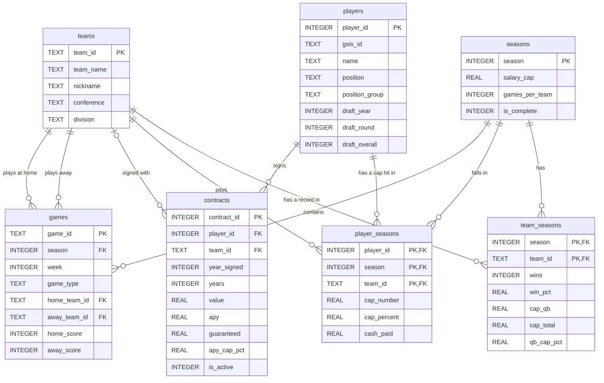

# Database design (ER diagram)

The database lives at `data/gridironcapiq.db` and is built by `python src/build_database.py` from the tables in [`sql/schema.sql`](../sql/schema.sql). Money is in $ millions.

## How to read it

- **One table per real-world thing.** Teams, seasons, games, players and contracts each get their own table, so a fact like a team's division is stored once.
- **`player_seasons` is the bridge to money.** A contract is signed once, but a player counts against the cap every season. This table holds the real cap hit per player, per season, per team, and it's what cap-by-position totals are built from.
- **`team_seasons` is the analysis table.** One row per team per finished season, with wins and cap spending by position group. In Phase 4 the goal is to rebuild it with SQL from `games` and `player_seasons`.
- **Composite primary keys.** `player_seasons` is unique on (player, season, team) because a player traded mid-season has a cap hit with two teams.
- **`contracts.team_id` can be empty** when the source lists several teams (like `NYJ/GB`); the original text is kept in `team_label`.

## Known limits

- Cap hits cover the contracts OverTheCap tracks: about 80-89% of the league cap per team. Compare teams by share, not raw dollars.
- Dead money (cap charges for players no longer on the team) is not in the data.
- `seasons.salary_cap` is filled for 2011-2025; later seasons are NULL.
